# Website Bán Ảnh Có Bản Quyền

Đây là báo cáo cuối kì cho project "Website Bán Ảnh Có Bản Quyền" (Copyrighted Photo Selling Website), một nền tảng trực tuyến toàn diện được phát triển trong môn học Thực tập Lập trình Web tại Khoa Công nghệ Thông tin, Trường Đại học Nông Lâm TP.HCM.

## Giới thiệu dự án

Website là một nền tảng chuyên cung cấp dịch vụ tìm kiếm, mua bán và tải xuống các hình ảnh có bản quyền, phục vụ cho cả mục đích cá nhân và thương mại (như thiết kế đồ họa, quảng cáo, bài viết blog). Nền tảng này tạo điều kiện cho người dùng tiếp cận kho ảnh chất lượng cao và cho phép các nhiếp ảnh gia, nghệ sĩ đăng tải, quản lý danh mục ảnh và kiếm doanh thu từ tác phẩm của họ. Website được thiết kế với giao diện trực quan, thân thiện, bảo mật cao và tích hợp nhiều phương thức thanh toán linh hoạt (thẻ tín dụng, ví điện tử, chuyển khoản ngân hàng) để mang lại trải nghiệm mượt mà và tiện lợi cho người dùng.

## Giao diện chính
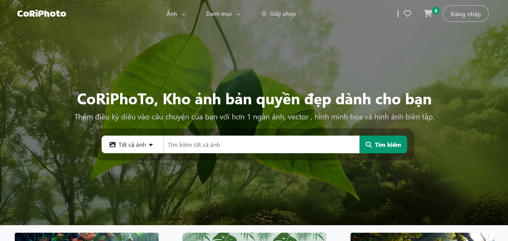

## Các chức năng chính

Website cung cấp các chức năng đa dạng cho ba vai trò người dùng chính: Người mua, Người bán và Quản trị viên (Admin).

### Chức năng của Người mua

* **Đăng ký và Đăng nhập:** Tạo tài khoản cá nhân và đăng nhập để sử dụng các tính năng của website.
        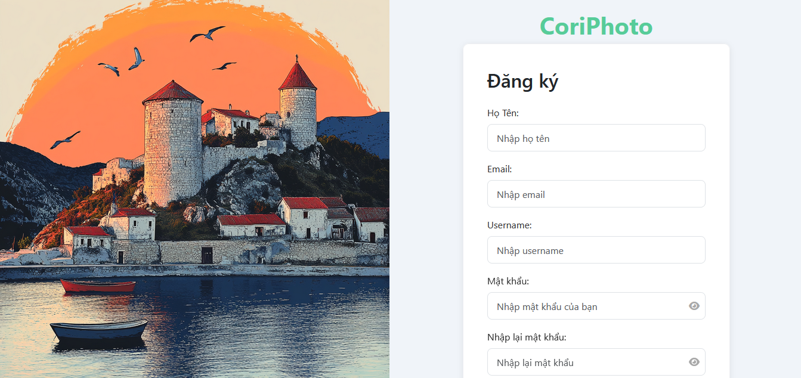
        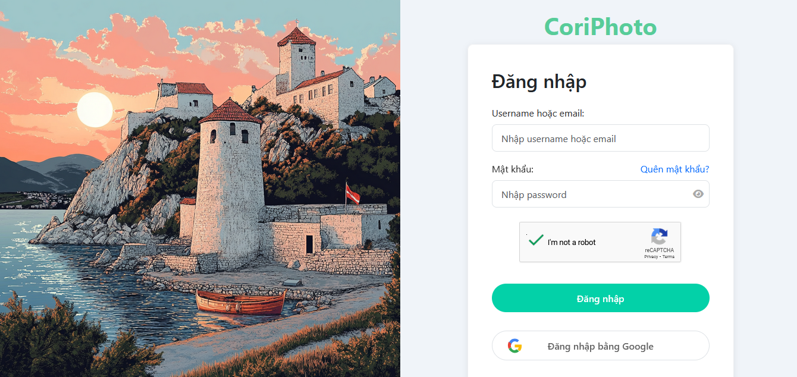

* **Tìm kiếm ảnh:** Tìm kiếm hình ảnh theo từ khóa, danh mục hoặc các bộ lọc nâng cao (kích thước, màu sắc, độ phân giải, loại giấy phép).
      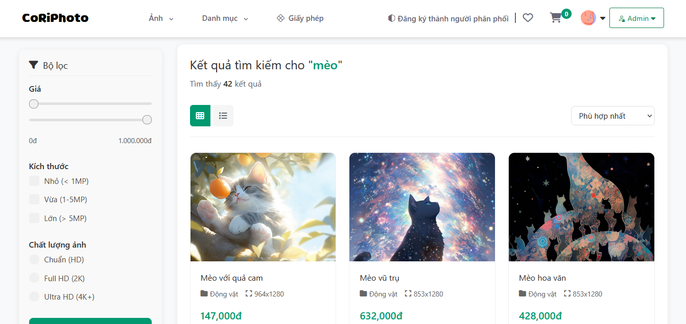

* **Xem và lưu ảnh yêu thích:** Xem chi tiết ảnh và lưu vào danh sách yêu thích để truy cập lại sau.
  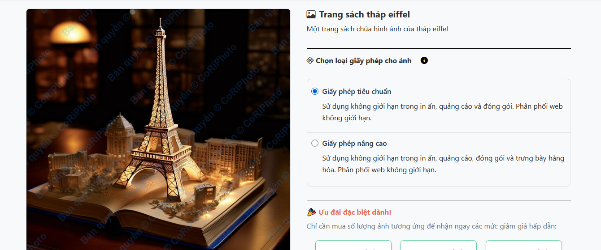
  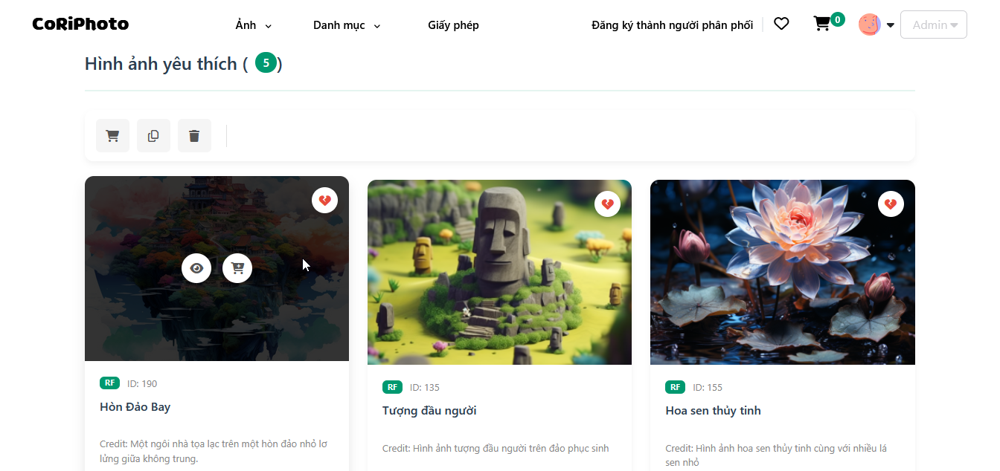

* **Mua ảnh:** Lựa chọn và thanh toán ảnh qua thẻ tín dụng, ví điện tử hoặc chuyển khoản ngân hàng. Người dùng nhận liên kết tải ảnh chất lượng cao kèm giấy phép sử dụng rõ ràng sau khi thanh toán.
  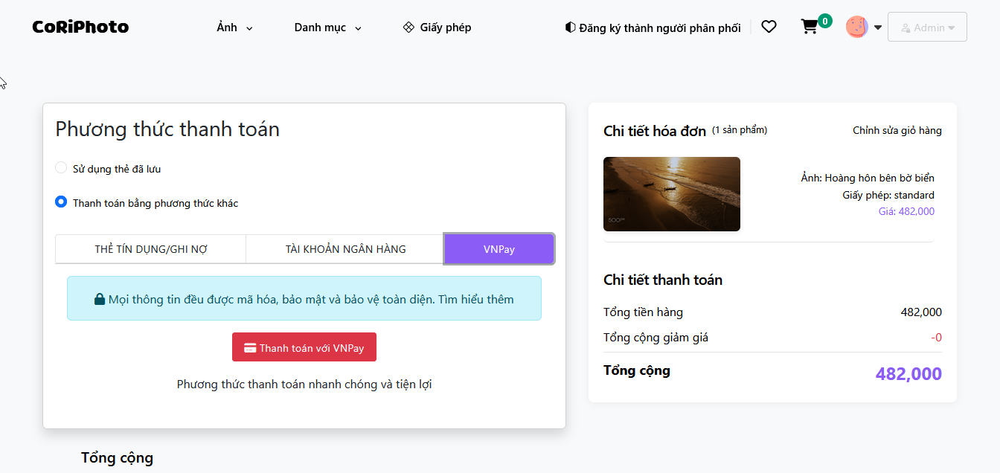

* **Giỏ hàng:** Lưu trữ các ảnh muốn mua hoặc có dự định mua phục vụ cho công việc.
  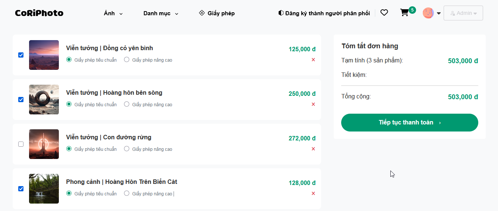

* **Quản lý hồ sơ cá nhân:** Cập nhật thông tin cá nhân như tên, email, mật khẩu và phương thức thanh toán.
  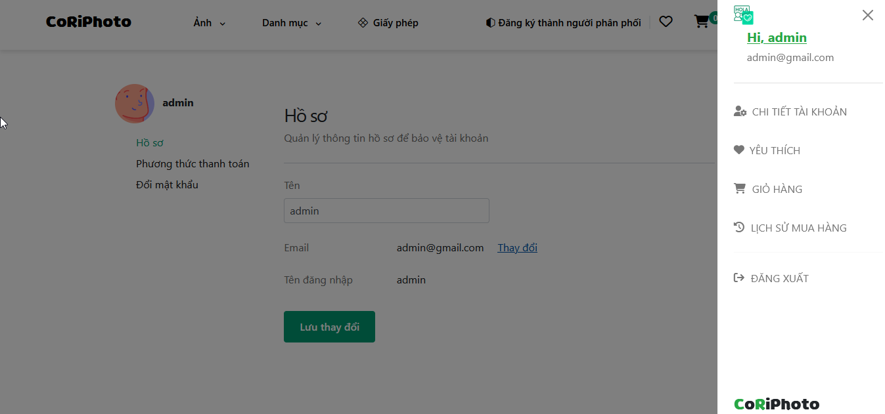

* **Xem lịch sử mua hàng:** Theo dõi danh sách các giao dịch và ảnh đã mua.
      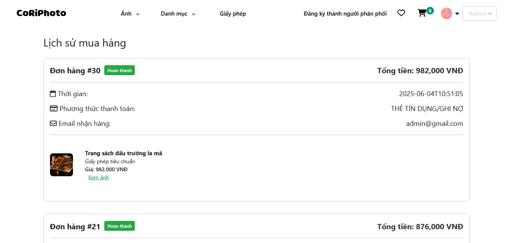

### Chức năng của Người bán

* **Đăng ký làm Người bán:** Tạo tài khoản người bán và cung cấp thông tin cần thiết để được phê duyệt.
* **Tải ảnh lên:** Đăng tải ảnh lên hệ thống, thêm mô tả, từ khóa và danh mục để tăng khả năng hiển thị.
      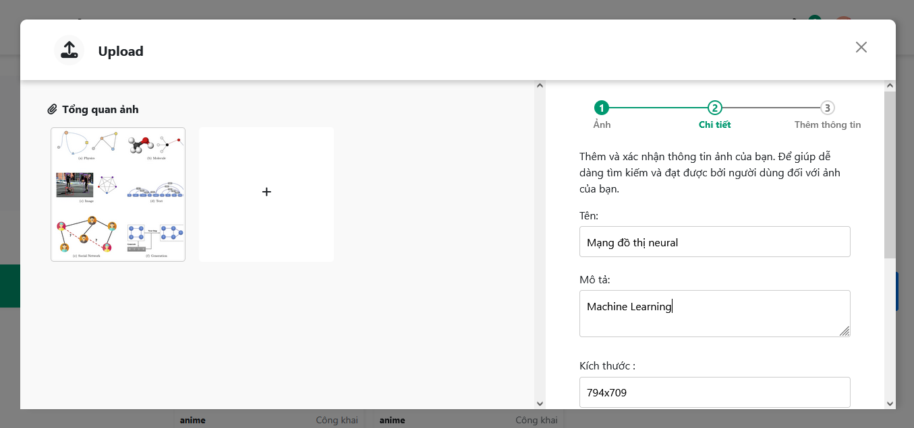

* **Quản lý danh mục ảnh:** Xem, chỉnh sửa hoặc xóa các ảnh đã tải lên (trước hoặc sau khi phê duyệt).
        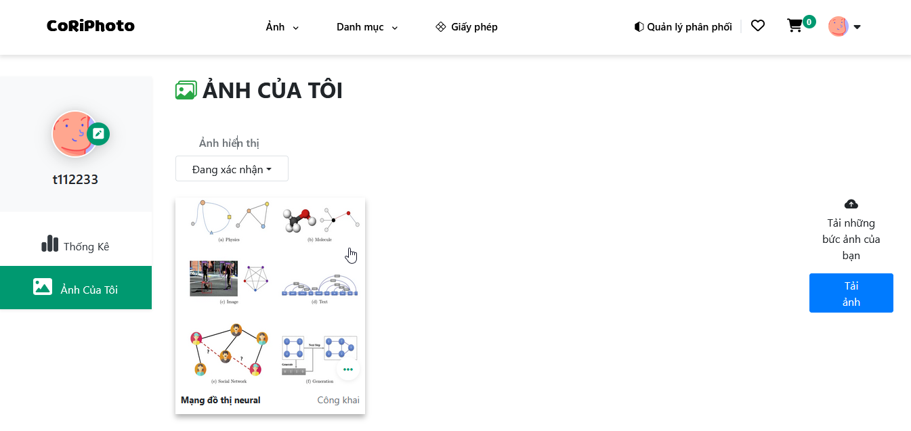

* **Theo dõi doanh thu:** Xem thống kê doanh thu từ ảnh đã bán và lịch sử giao dịch. Người bán nhận doanh thu dựa trên tỷ lệ phần trăm đã thỏa thuận khi ảnh được bán.
      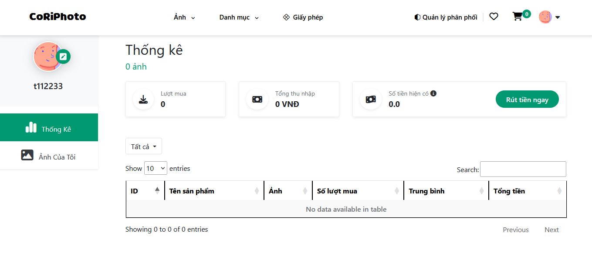

### Chức năng của Admin

* **Quản lý người dùng:** Xem, chỉnh sửa hoặc khóa tài khoản người mua và người bán nếu vi phạm chính sách.
* **Phê duyệt ảnh:** Kiểm duyệt ảnh do người bán tải lên, đảm bảo chất lượng và tính hợp pháp (chấp nhận hoặc từ chối).
* **Quản lý danh mục:** Tạo, cập nhật hoặc xóa các danh mục ảnh để đảm bảo sự đa dạng và dễ tìm kiếm.
* **Xem thống kê:** Theo dõi số liệu về đơn hàng, doanh thu và số lượng ảnh bán được.
* **Quản lý giao dịch:** Theo dõi và xử lý các vấn đề liên quan đến thanh toán hoặc doanh thu của người bán.
* **Ghi nhật ký:** Xem các hoạt động của người dùng (đăng nhập, đăng xuất, xác minh email, thanh toán đơn hàng, upload ảnh).
* **Phân quyền:** Phân chia các quyền người dùng cho các tài khoản admin khác (chỉ admin có quyền phân quyền mới có thể thực hiện).
    * *Dashboard Admin:*
      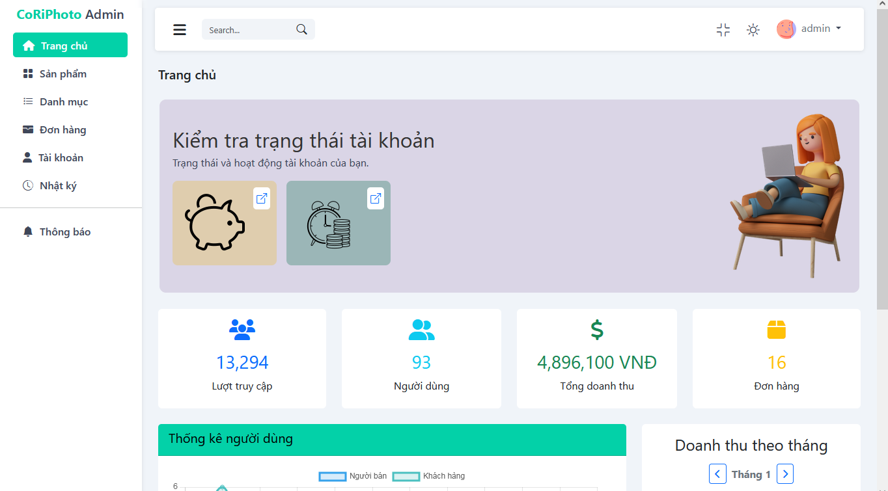
    * *View Admin Product:*
        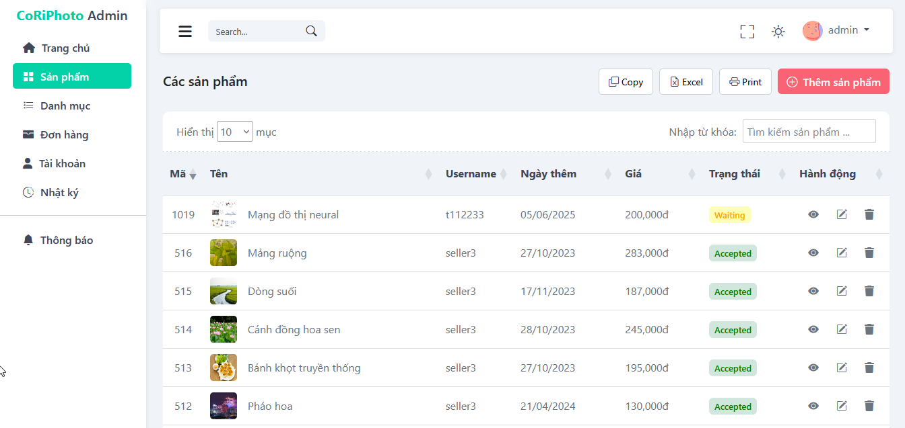

### Các chức năng khác

* **Khóa đăng nhập:** Hệ thống sẽ khóa tài khoản trong 10 phút và gửi liên kết mở khóa vào email người dùng nếu đăng nhập sai mật khẩu quá 5 lần.
* **Khóa tài khoản:** Admin có thể khóa tài khoản thủ công nếu phát hiện các biểu hiện bất thường từ nhật ký. Tài khoản cũng sẽ tự động bị khóa trong 1 ngày nếu đăng nhập sai quá nhiều lần (ví dụ: 200 lần trong 1 giờ).

## Đóng góp
Dự án này được thực hiện bởi Nhóm 18, gồm các sinh viên:
* Nguyễn Thanh Thương
* Huỳnh Đăng Khanh
* Võ Hoàng Phúc
